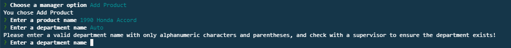

# The Bamazon Store
A CLI application modeled after an Amazon type buying environment powered by SQL and inquirer.js

## Main Features
Bamazon features three main program environments- a customer, manager, and supervisor. Each has different SQL query powered

### Running Bamazon Customer
Bamazon can be ran by entering `node bamazon_customer.js` in the command line from the project folder. The customer will be greeting with the following screen:

To purchase an item, enter to corresponding item ID. The customer will then be asked to enter how many items to purchase. The database will update and wil display the updated product sales:

### Running Bamazon Manager
The bamazon manager is started by entering `node bamazon_manager.js`. The manager is able to perform more actions than a regular customer:

Viewing All Products:

Viewing Low Inventory:

Adding Inventory to existing products:

Adding New Products:

### Running Bamazon Supervisor
The bamazon supervisor is run by entering `node bamazon_supervisor.js`. The supervisor can view product sales by department, and add new departments

Product Sales by department:

Adding a new department:

